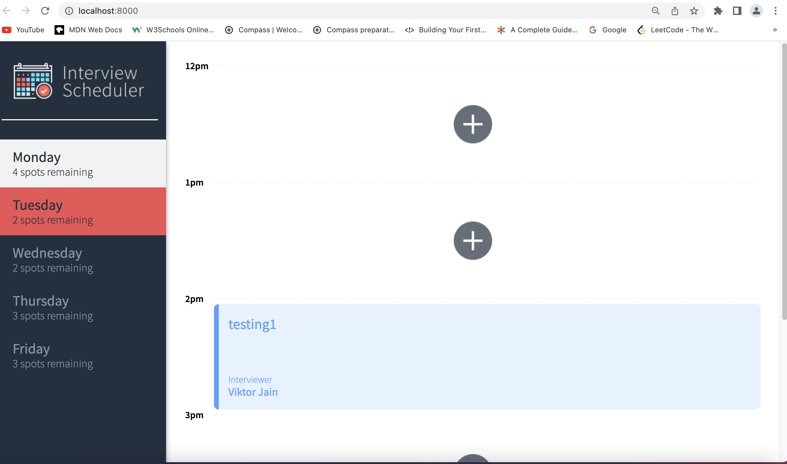

# Interview Scheduler

## Setup

1.Delete package-lock.json and node_modules.<br/>

2.Install dependencies with `npm install`.<br/>

3.Create .env file in the root folder with the content
`SKIP_PREFLIGHT_CHECK=true` in it.<br/>
4.Create .env.development file with the following:<br/>
REACT_APP_WEBSOCKET_URL=ws://localhost:8001<br/>
PORT=8000<br/>
CHOKIDAR_USEPOLLING=false<br/>

4.To set up scheduler-api server, fork and clone the scheduler-api from https://github.com/lighthouse-labs/scheduler-api into a new directory (NOT in the same directory as the Scheduler). The server runs at port 8001.

## Running Webpack Development Server

```sh
Use "npm run start" command for both Scheduler and scheduler-api server.
```

The app will be served at <http://localhost:8000/>

## Running Jest Test Framework

```sh
npm test
```

## Running Storybook Visual Testbed

```sh
npm run storybook
```

## run npm start and expect to see the page below


